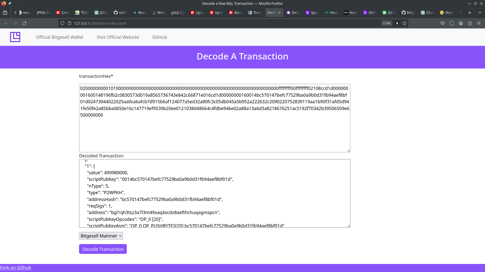

## Decode Raw Bitgesell Transaction Hex format

Decodes raw Bitgesell transaction in Hex format, with BGLd these transaction is created by
calling the `createrawtransaction` JSON-RPC method:

```js
createrawtransaction [{"txid":"hex","vout":n,"sequence":n},...] [{"address":amount},{"data":"hex"},...] ( locktime replaceable )
```

See complete details here: [createrawtransaction](https://bitgesell-docs.netlify.app/rpc/createrawtransaction)

or, 
Transaction created through `jsbgl` library:
```js
const txObject = new Transaction()
txObject.addOutputs(...)
txObject.addInputs()
const serializedTx = txObject.serialize() // serializes the tx to Hexadecimal format for broadcasting
```
Example:

An example Bitgsell transaction in `Hex` format:

```js
"020000000001010000000000000000000000000000000000000000000000000000000000000000ffffffff00ffffffff02108ccd1d000000001600148196fb2c0830573d019a8565736743e842c66871e016cd1d00000000160014bc570147befc77529ba0a9b0d31fb94aef8bf01d02473044022025aa0ca6afcb7d915b6af124077a5ed32a80fc3c05db045a5b952a222632c2090220752839119aa1b90f31afd5d941fe50fe2a85bba0650e16c147719ef9539b20ee0121038d48664c4fdbe946e02a88a13a6d3a8218676251ac5192f70342b39506509e6500000000"
```

Decoded to:
```js
{
  "autoCommit": true,
  "format": "decoded",
  "testnet": false,
  "segwit": true,
  "txId": "c0fd5146a745908631ab36ff975863175597e45d151a0d1bacc9f29f0817fef5",
  "hash": "b1b370b0c5563cbf01a32ea4f43f6c4e97a3d282c706e23585bcfcc244dedef7",
  "version": 2,
  "size": 222,
  "vSize": 141,
  "bSize": 113,
  "vIn": {
    "0": {
      "txId": "0000000000000000000000000000000000000000000000000000000000000000",
      "vOut": 4294967295,
      "scriptSig": "",
      "sequence": 4294967295,
      "txInWitness": [
        "3044022025aa0ca6afcb7d915b6af124077a5ed32a80fc3c05db045a5b952a222632c2090220752839119aa1b90f31afd5d941fe50fe2a85bba0650e16c147719ef9539b20ee01",
        "038d48664c4fdbe946e02a88a13a6d3a8218676251ac5192f70342b39506509e65"
      ]
    }
  },
  "vOut": {
    "0": {
      "value": 500010000,
      "scriptPubKey": "00148196fb2c0830573d019a8565736743e842c66871",
      "nType": 5,
      "type": "P2WPKH",
      "addressHash": "8196fb2c0830573d019a8565736743e842c66871",
      "reqSigs": 1,
      "address": "bgl1qsxt0ktqgxptn6qv6s4jhxe6rappvv6r342vmx3",
      "scriptPubKeyOpcodes": "OP_0 [20]",
      "scriptPubKeyAsm": "OP_0 OP_PUSHBYTES[20] 8196fb2c0830573d019a8565736743e842c66871"
    },
    "1": {
      "value": 499980000,
      "scriptPubKey": "0014bc570147befc77529ba0a9b0d31fb94aef8bf01d",
      "nType": 5,
      "type": "P2WPKH",
      "addressHash": "bc570147befc77529ba0a9b0d31fb94aef8bf01d",
      "reqSigs": 1,
      "address": "bgl1qh3tsz3a7l3m49xaq4xcdx8aefthchuqagmspcn",
      "scriptPubKeyOpcodes": "OP_0 [20]",
      "scriptPubKeyAsm": "OP_0 OP_PUSHBYTES[20] bc570147befc77529ba0a9b0d31fb94aef8bf01d"
    }
  },
  "rawTx": null,
  "blockHash": null,
  "confirmations": null,
  "time": null,
  "blockTime": null,
  "lockTime": 0,
  "blockIndex": null,
  "coinbase": true,
  "fee": null,
  "data": null,
  "amount": 999990000,
  "flag": "01",
  "weight": 561
}
```


Try it out: https://bgl-decode-tx.netlify.app/

## Contribution

All kinds of contribution are highly welcome, for example a broadcast feature can be great since the transaction is technically already signed with all inputs and outputs and or data.

### License: `MIT`
